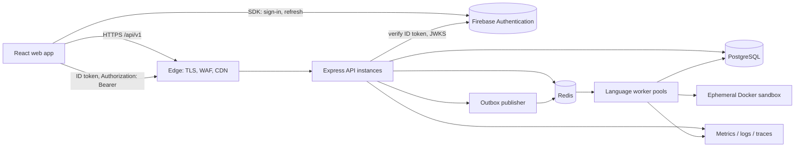
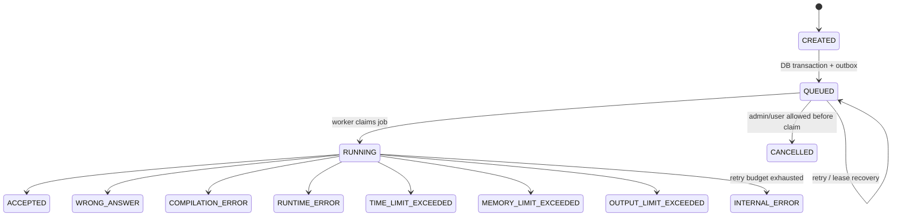
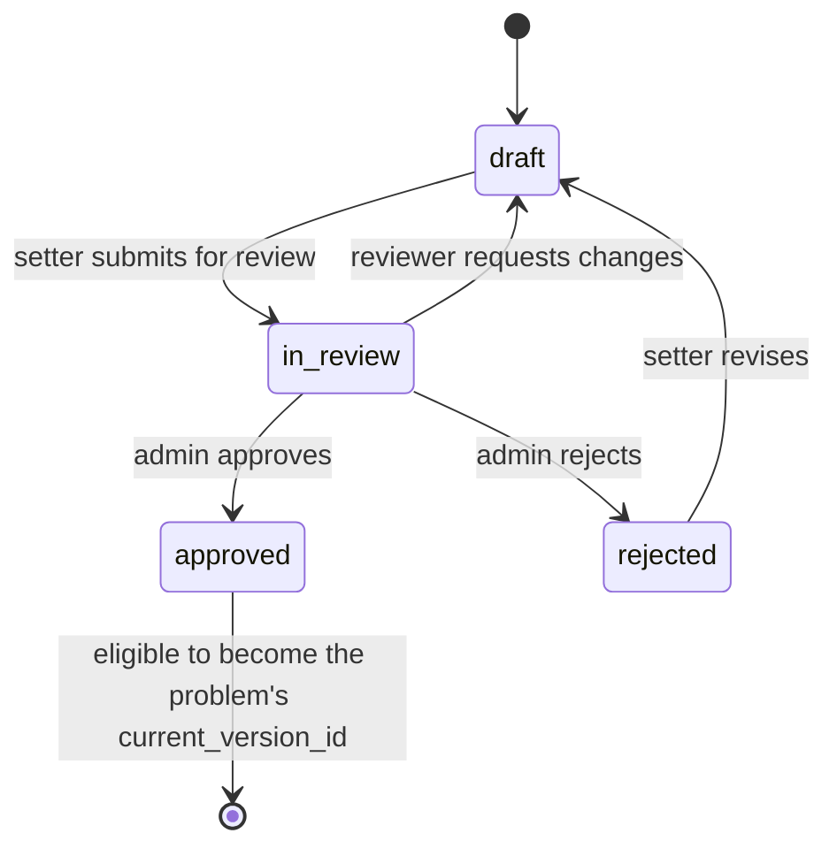
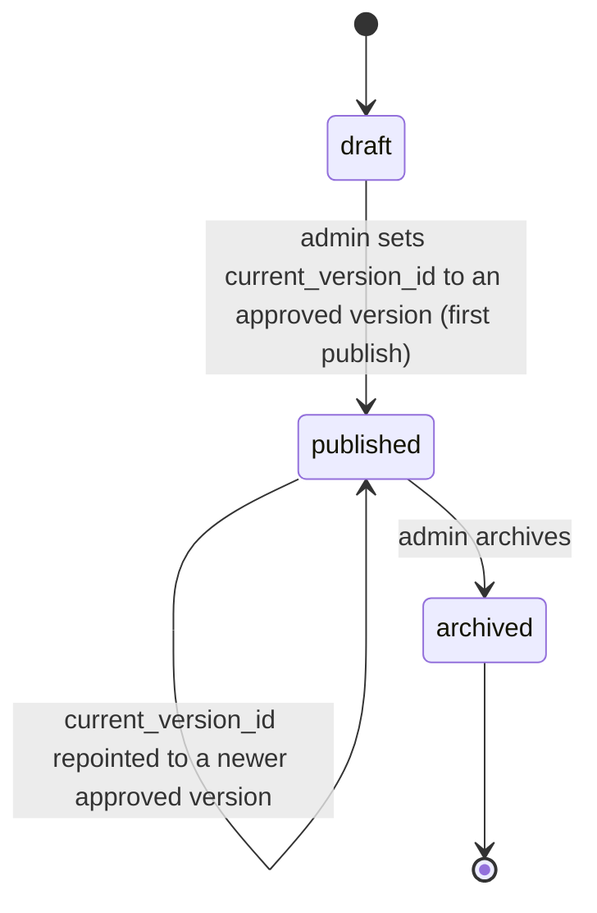

# Online Code Judge Platform — Master Product, SRS, System Design & Implementation Specification

**Status:** Authoritative build specification · **Version:** 1.0 (pre-release, under active build) · **Primary stack:** React, Node.js/Express, PostgreSQL, Redis, Docker

> Build a trustworthy developer product for learning and evaluating code—not a branded clone of any existing product. This document makes deliberate choices so implementation does not repeatedly stall on unspecified details.

## 1. Product decision, vision, and boundaries

### Vision
Provide a polished place where learners solve programming problems, run code, and submit solutions evaluated safely against public and hidden cases. It must be credible as a startup-grade system: secure untrusted-code execution, predictable results, recoverable failures, and a calm developer-focused UI.

### In scope (MVP)

* Email/password accounts; verification, reset, secure sessions, and roles: `USER`, `PROBLEM_SETTER`, `ADMIN`.
* Problem discovery, problem detail, tags/difficulty, starter code, examples, hidden/public test cases, code run, asynchronous submission, result/history.
* JavaScript/Node.js, Python, Java, and C++ (four languages), deterministic compiler/runtime versions, five-second per-test execution limit and **256 MiB** memory cap. **Total submission budget (closes a gap in v1.0):** compile phase ≤15 s (per §9's language-specific compile timeouts), execution phase ≤45 s wall-clock summed across all cases, hard submission ceiling of **60 s compile+execute combined**, and a maximum of **200 test cases per problem version**. Whichever limit is hit first ends the run: exceeding the summed execution budget with cases still pending yields `TIME_LIMIT_EXCEEDED` on the submission (not a silently truncated result), so hidden-case count can never turn one submission into a multi-minute job.
* A problem-setter/admin back office, audit trail, moderation/publishing workflow, notifications, operational dashboards, and deployable Docker environment.

### Explicitly out of scope for MVP
OAuth/SSO, paid plans, collaborative editing, public discussions, real-time contests, mobile native apps, custom compiler images supplied by users, AI proctoring, and **fully custom (user/setter-scripted) checkers**. Their data/API boundaries are reserved now; they are not half-built now. **Why:** security and reliable judging are the product’s hard core. Premature features create attack surface and delay it.

**Note on judging correctness:** exact-match output comparison alone is too narrow for a general problem catalogue (it cannot correctly judge floating-point answers or unordered results, which are common even in beginner-level problems). A *built-in* checker mode — `exact` | `float_tolerance` | `unordered_tokens` — is therefore pulled into MVP scope (see §9a); only arbitrary reviewer-supplied checker *code* stays deferred to a later, reviewed feature, since that reopens the sandboxing problem this document works hard to close.

### Success measures

**Reliability/security (system):**
* ≥99.5% monthly API availability (excluding planned maintenance); P95 read API <300 ms at normal load.
* ≥99% of valid submissions reach terminal state within 60 seconds under supported load; no duplicate terminal result.
* Zero deliberate network access from sandboxed submissions; all containers cleaned after execution.
* 100% write endpoints have validation, authorization, request IDs, structured logs, and documented errors.

**Product/growth (business):** infra SLOs alone do not indicate the product is succeeding — track these from week one, even with rough instrumentation:
* Activation: % of verified users who submit at least one solution within 24 hours of registration.
* Retention: D7 and D30 returning-user rate; problems-solved-per-active-user trend over time.
* Catalogue health: number of published problems per difficulty/tag band; % of problems with zero attempts (signals discoverability or quality issues).
* Acquisition: share of new registrations attributable to organic/search traffic vs. direct — informs whether the SEO investment in §12a is paying off.
* Judge trust: rate of user-reported wrong-verdict disputes per 1,000 submissions — a proxy for checker correctness (see §9a), which directly affects whether users trust and return to the platform.

**Initial supported capacity (closes a gap in v1.0 — turns "scale later" into a number):** these are launch-day targets, not aspirational ceilings; §3 Phase 3 revisits them once real measurements exist.
* ≤2,000 registered users, ≤200 daily active users, peak ≤20 submissions/minute.
* ≤8 concurrent sandbox executions across the worker pool at launch sizing (2 sandboxes/host × 4 hosts, matching §10's per-host concurrency note).
* Queue wait target: P95 <10 s from `QUEUED` to `RUNNING` at the above load; beyond it, backpressure (§10) engages rather than unbounded queueing.
* Database sizing budget: plan storage for ≤500 GB at launch (dominated by encrypted test cases and submission history), reassess before it's a surprise.
* These numbers exist so infra choices (single-region, managed Postgres tier, worker host count) are a sizing decision now instead of a guess discovered under load.

### Personas and permissions

| Persona | Needs | May do |
|---|---|---|
| Learner/User | solve, track progress | view published problems; run/submit own code; view own history/profile |
| Problem setter | author safely | create drafts; edit own drafts; upload test cases; submit for review |
| Admin | protect product | all setter capabilities; review/publish/archive; manage roles/reports; view audit/ops data |
| Worker service | judge only | consume execution jobs and update job/result records; no human-facing permissions |

Role checks are server-side and object-level. A setter cannot edit another setter’s draft unless admin. Never treat a hidden button as authorization.

### Assumptions and product rules

* PostgreSQL is the system of record; Redis is disposable transport/cache, never sole truth.
* Test-case input/output are encrypted at rest using the envelope-encryption model detailed in §9 ("Hidden test-case encryption"); hidden cases are never returned by APIs or logs.
* A submitted solution is immutable. Rejudge creates a new `judging_attempt`, retaining the original result.
* Standard judging is exact normalized output (trim trailing whitespace and normalize CRLF); special/custom checkers are a later, reviewed feature.
* Timestamps are UTC; API strings are ISO-8601; UI renders local time.

## 2. Requirements

### Functional requirements

**Identity.** Authentication is delegated to **Firebase Authentication** (email/password provider) rather than a self-hosted credential store — see the "Authentication provider" note in §5 for the full design. Requirements unchanged in spirit, revised for what Firebase actually supports: register without account enumeration; verify email before submission; login/logout; "sign out of all devices" (Firebase's global refresh-token revocation); password reset; a locally-tracked, informational device/session list. **One capability is reduced from v1.0's original design and called out explicitly:** Firebase supports revoking *all* of a user's sessions at once, not one specific device — true single-device revoke is not available without building a custom token-introspection layer, which is out of scope for MVP. Admin role changes still revoke all active sessions (via Firebase's `revokeRefreshTokens`, mirrored by the existing `users.auth_version` bump so already-issued-but-unexpired ID tokens are still rejected server-side within the staleness window described in §5).

**Problems.** List/filter/search published problems; stable slug URL; display statement, constraints, examples, tags, difficulty, supported languages, starter code, and submission history. Setters draft, preview, submit for review, publish, unpublish, archive, version, and attach cases. Published edits that affect judging create a new problem version and require review.

**Test-case ingestion controls (closes a gap in v1.0 — imports were assumed safe with no stated validation path):** setter uploads (single files, CSV manifest, or ZIP bundle of case files) go through: a decompressed-size cap enforced *while* streaming (reject before fully inflating, not after — standard decompression-bomb defense) with a hard ratio limit (e.g. reject if decompressed:compressed exceeds 100:1); a maximum of 200 cases per problem version (matching §1's execution-budget cap, since more hidden cases than that can't run within the total budget anyway) and per-case input/output size caps (e.g. 5 MiB each) enforced before the case is persisted, not discovered at judge time; duplicate-case detection via `input_sha256` (already a `test_cases` column) so identical cases aren't silently double-charged against the case-count cap; and a **mandatory setter self-check run** — the setter must successfully run their own reference solution (or a provided expected-output set) against every uploaded case in preview mode before the problem can be submitted for review, so `in_review` never starts on cases nobody has verified actually judge correctly.

**Upload transport (closes a v1.0 gap — the general 1 MiB API payload cap in §2 cannot carry a 5 MiB case):** case uploads use a dedicated authenticated route, separate from the general JSON API and its 1 MiB cap: a direct multipart/streaming upload endpoint (`POST /admin/problems/:id/versions/:versionId/cases/upload`) with its own limits — 5 MiB per case file, 50 MiB per ZIP bundle, request-level timeout independent of the general API timeout. This path still sits behind the same authentication/authorization middleware (§7) as every other admin/setter route, additionally runs the decompression-bomb and size-cap checks above *during* the stream (not after full receipt), and performs basic content validation (rejecting binaries/executables where plain text is expected, since case files are text I/O, not arbitrary payloads) before anything is written to `test_cases`. Ordinary JSON endpoints keep the 1 MiB cap unchanged — this is a scoped exception for one upload path, not a general limit increase.

**Run and submit.** Run uses only public/sample cases and a smaller quota; submit uses all case groups, returns `submissionId` immediately, shows `QUEUED → RUNNING → terminal`, stores aggregate and per-case metadata but never hidden input/expected output. Terminal verdicts: `ACCEPTED`, `WRONG_ANSWER`, `COMPILATION_ERROR`, `RUNTIME_ERROR`, `TIME_LIMIT_EXCEEDED`, `MEMORY_LIMIT_EXCEEDED`, `OUTPUT_LIMIT_EXCEEDED`, `INTERNAL_ERROR`, `CANCELLED`.

**Administration.** Queued review dashboard, reports (problem/user/submission), user suspension, case previews restricted to owner/admin, audit search, job retry only with explicit reason, DLQ review, platform notices.

**Integrity/moderation.** Accepted submissions for a given problem are fingerprinted and compared against other accepted solutions for the same problem version; pairs above a similarity threshold are queued into `abuse_reports` (type `PLAGIARISM_SUSPECTED`) for admin review — never auto-penalized. **Scope correction from v1.0:** the fingerprinting method is **token/n-gram hashing only** (normalize whitespace/identifiers, hash sliding n-grams of the token stream, compare via a similarity index like MinHash) — this is language-agnostic and cheap. The earlier draft additionally suggested per-language AST normalization; that's dropped from MVP, since building and maintaining a correct AST normalizer for four languages is a substantial subsystem on its own and isn't worth blocking judge launch over. The service ships behind a **feature flag**, defaulting off until it's been validated against a labeled sample of known-similar/known-different submissions, so a noisy detector can't flood the moderation queue before it's trustworthy. This runs as a low-priority batch job (see `maintenance` queue, §10), not inline with judging, so it cannot slow down submission turnaround. **Why this isn't deferred like contests/AI-proctoring:** those are bounded to a mode you opt into (a live contest); solution copying is a standing risk the moment the catalogue and user base are public, and retrofitting fingerprinting after years of unfingerprinted historical submissions is far more painful than shipping the (deliberately simple) detector from day one, even if the reviewer UI or a future AST-based upgrade ships later.

**Notifications.** In-app notifications for verification, password/security events, problem review, submission internal failure, and account actions. Email is optional/asynchronous and must not block the action.

### Non-functional requirements

* HTTPS only in non-development; stateless horizontally scalable API and dedicated workers.
* API read availability favors graceful degradation; judge results favor correctness over speed—do not mark accepted after uncertain persistence.
* Accessible to WCAG 2.2 AA target; keyboard-only coding and editor controls; reduced-motion support.
* Default privacy-minimizing telemetry; no code/test content in analytics.
* API payload cap 1 MiB (source code ≤256 KiB); public list page ≤100, default 20.

## 3. Product phases and key tradeoffs

| Phase | Deliverable | Deliberate decision / why |
|---|---|---|
| 0 Foundation | repo, CI, local compose, auth skeleton, migrations, logs | establish repeatability before features |
| 1 MVP | four languages, problems, queue/workers, secure judge, basic admin | one queue and one deployable region; simplest safe boundary |
| 2 Hardening | email flows, review/versioning, outbox, tracing, backups/restore drill, load tests | reliability before marketing features |
| 3 Growth | autoscaling pools, CDN, read replica, contest module | only after measurements show need |

Use REST over GraphQL: resources and permissions are well bounded, caching is straightforward, and the team avoids a broad query-authorization surface. Use polling (2 seconds while active, exponential to 10 seconds) for submission status in MVP; it works through proxies and reconnects cleanly. Add SSE later only for high-volume live status/contest feeds—WebSockets are not justified for one-way, infrequent status updates.

## 4. Architecture



### Component contract and why

* **React SPA:** immediate editor experience and local autosave; also hosts the Firebase Client SDK for sign-in/sign-up/password-reset UI and automatic ID-token refresh. Do not place policy or secret logic in it.
* **Firebase Authentication (added — replaces the self-hosted credential store described in v1.0's original §5):** identity provider of record for email/password accounts — owns password hashing, verification email delivery, password-reset email delivery, and ID-token issuance/refresh. It is an *authentication* boundary only; it holds no opinion on `USER`/`PROBLEM_SETTER`/`ADMIN` roles or object ownership — those stay exactly where they already were, in Postgres (`user_roles`, per-resource ownership checks), consistent with §5's existing rule that "JWTs are not used where a database capability/object authorization check is required." Firebase's own token signing keys are never the DB's transitive trust anchor for authorization decisions — only for "is this a real, currently-valid identity."
* **Express API:** validates a Firebase-issued ID token per request (Admin SDK / cached JWKS, §7), authorizes against Postgres-held roles/ownership, writes durable intent, and serves queries. It never executes user code; this keeps web nodes safe and responsive. It also never touches Firebase-issued passwords — password verification never transits the API at all.
* **PostgreSQL:** normalized durable source of truth, constraints/transactions, auditability — including the account/role/ownership data Firebase intentionally doesn't manage. Do not use Redis as the primary database.
* **Redis + BullMQ:** decouples slow code execution from HTTP and supports delayed retries. It is not exactly-once; consumers are idempotent.
* **Outbox publisher:** closes the DB-write/queue-publish gap. Do not use it for trivial noncritical analytics; use it for submissions, security notifications, and publish events.
* **Worker + Docker:** execution boundary. Docker is defense-in-depth, not a perfect hostile-code VM; for public internet scale move workers to isolated hosts/VMs (gVisor/Firecracker) behind a separate network account.

### Deployment topology

Development: Compose services (`web`, `api`, `worker`, `postgres`, `redis`, `mailpit`, `otel`) plus the **Firebase Local Emulator Suite** for Auth (`firebase emulators:start --only auth`) so local development never touches real user data or a live Firebase project. Staging: production-like isolated database, synthetic cases, no real user data, and its own dedicated Firebase project (never share a Firebase project between staging and production — a staging bug should not be able to touch real user accounts). Production: TLS/load balancer → ≥2 API replicas; PostgreSQL managed HA/backups; Redis managed with persistence; worker nodes separated from API/database network; object storage for encrypted exports. API pods may reach DB/Redis and the Firebase Admin SDK's token-verification endpoint (public JWKS, no secret credential needed for verification itself) only; worker nodes may reach DB/Redis and local Docker socket only. Neither sandbox nor container can reach network, including Firebase — a submission sandbox has no legitimate reason to ever talk to an identity provider.

## 5. State machines and flows

### Submission lifecycle



Terminal states never change. Worker first atomically changes `QUEUED` to `RUNNING` only if the row is still queued; duplicate queue delivery then becomes a no-op. Cancellation is best effort: only queued jobs are cancellable for users; admin cancellation during run kills the sandbox and records it.

### Durable submission sequence

1. API authenticates, checks verified account, role, per-user quota, problem publication/version, language and source size; validates schema.
2. One transaction inserts `submissions`, `execution_jobs(QUEUED)`, and an `outbox_events(SUBMISSION_QUEUED)` row. Return `202` with ID and status URL.
3. Publisher claims outbox rows with `FOR UPDATE SKIP LOCKED`, enqueues a deterministic BullMQ job ID (`execution_job.id`), then marks event published. If it crashes, the same ID makes re-enqueue harmless.
4. Worker claims the durable job, creates a private temporary workspace, compiles once, executes ordered test cases, enforces limits, persists aggregate/result transactionally, and always tears down workspace/container in `finally`.
5. UI polls `GET /submissions/:id` until terminal. Browser loss changes nothing.

### Authentication/session lifecycle

**Authentication provider (replaces v1.0's self-hosted JWT/refresh-rotation design with Firebase Authentication):**

* **Identity:** the React SPA uses the Firebase Client SDK for `createUserWithEmailAndPassword`, `signInWithEmailAndPassword`, `sendEmailVerification`, and `sendPasswordResetEmail` — Firebase owns password hashing (scrypt-based, per Google's implementation), verification-email delivery, and reset-email delivery. The API never receives a raw password at any point.
* **Tokens:** Firebase issues a short-lived **ID token** (JWT, ~1 hour expiry, auto-refreshed by the Client SDK using Firebase's own refresh token, which the SDK manages internally — the application code never sees or stores it directly). The SPA attaches the current ID token as `Authorization: Bearer <idToken>` on every API call, matching v1.0's existing "do not put it in localStorage" rule — the Firebase SDK keeps it in memory/IndexedDB under its own management, not application-controlled storage.
* **Verification:** the API verifies each ID token via the Firebase Admin SDK (`verifyIdToken`), which checks the signature against Google's public JWKS (cached, rotated automatically — no secret shared between API and Firebase for verification itself) and validates standard claims (`exp`, `iss`, `aud`). This replaces v1.0's asymmetric-key/`kid`-rotation JWT design; Firebase already implements that pattern for you.
* **Role/authorization data still lives in Postgres, unchanged from v1.0's architecture:** a verified ID token proves *who* the caller is (Firebase UID + verified email), never *what they're allowed to do*. Every request still resolves role and object ownership from `user_roles`/resource tables — matching the pre-existing rule "JWTs are not used where a database capability/object authorization check is required," now simply applied to Firebase's token instead of a homegrown one.
* **Revocation and the auth_version pattern (kept from v1.0, now layered on top of Firebase rather than replacing it):** on sensitive role/password changes, the API calls the Firebase Admin SDK's `revokeRefreshTokens(uid)` (forces the SDK to mint a new ID token on next refresh) **and** increments `users.auth_version`, checked server-side from short-lived cache on every request — this second layer exists because a already-issued, not-yet-expired ID token remains cryptographically valid for up to ~1 hour even after `revokeRefreshTokens` is called (revocation only blocks *future* refreshes), so `auth_version` closes that window immediately rather than waiting out token expiry. This is the same mechanism v1.0 already specified for its own JWTs, unchanged.
* **Session/device list (reduced scope from v1.0 — see §2):** the `sessions` table (schema in §11, since simplified) becomes an *informational* log of sign-ins (device/IP/user-agent, last-seen) for the user-facing "active sessions" screen, not a token-rotation ledger — Firebase manages the actual refresh mechanics. "Revoke" from this screen triggers the same `revokeRefreshTokens` + `auth_version` bump described above, which signs the account out everywhere, not just the selected device; the UI should say "sign out of all devices" rather than implying per-device revoke, since that's what actually happens.
* **Role assignment on first sign-in:** the API does JIT (just-in-time) provisioning — on a Firebase UID's first authenticated request, the API creates the corresponding `users` row (linked by `firebase_uid`) with default role `USER`. Role changes are Postgres writes (`user_roles`), not Firebase custom claims — keeping the single source of truth for authorization in the database the rest of the system already trusts, rather than splitting it across two systems.

### Problem lifecycle (revised — v1.0's single diagram used states `problems.status` never declared; this models two coupled state machines matching the corrected schema in §11)

**Version review state** (`problem_versions.review_status`) — this is where the actual editorial workflow lives:



**Problem entity state** (`problems.status`) — driven by whether *any* version has ever been made current:



* Only the owning setter may edit a version while its `review_status` is `draft`; once `in_review`, it's locked to that setter (no edits) until it returns to `draft` via `rejected` or reviewer request-changes — this matches §2's existing rule that role checks are object-level, applied here to editability, not just visibility.
* Publishing (`problems.status: draft → published`, or repointing `current_version_id` on an already-published problem) is an admin-only action gated on the target version's `review_status = approved` (already stated in §6's `POST /admin/problems/:id/publish`) — this section defines the precondition that endpoint enforces.
* A **published edit that affects judging** (statement, cases, checker config, limits) never mutates the live `problem_versions` row — it creates a new version at `review_status: draft`, which goes through `in_review → approved` independently, per the existing "published edits... create a new problem version" rule in §2. The previously published version keeps serving existing submissions' history and any run/submit made against it until the new version is approved *and* an admin repoints `current_version_id`.
* **Rollback:** publishing version N+1 does not delete version N; `problems.current_version_id` (a real FK, not a bare integer — corrected from v1.0) simply points elsewhere. Rolling back means admin repoints `current_version_id` back to the prior version's row — no data is destroyed, and every submission still records the exact `problem_version_id` it was judged against, so historical results never change meaning. `ON DELETE RESTRICT` on that FK also means a version currently pointed to can never be accidentally deleted. **Insert-order note:** because `problems.current_version_id` and `problem_versions.problem_id` reference each other, a problem row is always created with `current_version_id NULL`, its first `problem_versions` row is inserted afterward, and `current_version_id` is set in a follow-up `UPDATE` once that version is approved — the same two-step pattern any self-referential/circular FK requires, and worth calling out explicitly so it isn't rediscovered as a surprise during migration-writing.
* `archived` is a `problems`-level terminal state: an archived problem no longer appears in `/problems`, cannot be submitted to (`/runs`, `/submissions` return `404`/`410`), but existing submission history is retained and viewable by the original submitter. Individual versions are never separately "archived" — only the whole problem is.

## 6. API standard and representative contracts

Base `/api/v1`; JSON UTF-8; lowercase kebab-case paths; UUIDs externally. OpenAPI 3.1 is generated/validated in CI. Breaking change → `/v2`; add optional fields without version bump. Every response includes `X-Request-Id`; clients may send a validated UUID request ID.

**Pre-coding gate (closes a gap in v1.0):** the endpoint table below is intentionally representative, not exhaustive — before implementation begins, produce the complete `docs/openapi.yaml` (already referenced in §16's tree) covering every module in §7 (`auth`, `users`, `problems`, `submissions`, `execution`, `admin`, `notifications`, `audit`, `health`), including the full auth surface as revised for Firebase (`POST /auth/session` for JIT provisioning, `POST /auth/revoke-all`, session-list — registration/login/refresh/password-reset are Firebase Client SDK calls and are documented in `docs/` as client-side flows, not as Express endpoints, since they never hit this API), the setter workflow (draft CRUD, case upload, preview-run, submit-for-review), admin operations (review queue, publish/unpublish/archive, user suspension, DLQ retry, audit search), notification list/read endpoints, and pagination/filter conventions applied consistently across every list endpoint. Treat "the full OpenAPI contract exists and passes CI's diff check" as a gate before the first feature branch opens, not a document to backfill after endpoints are built ad hoc.

**Version support window:** once `/v2` ships, `/v1` remains fully functional for a minimum of 6 months, with a `Deprecation`/`Sunset` response header (RFC 8594) advertising the retirement date from the day `/v2` launches. The web SPA migrates to the new version immediately; the deprecation window exists for any external/API consumers, which matters once the platform has integrators or a public API tier.

**Envelope:** success `{ "data": ..., "meta": {"requestId":"..."} }`; errors `{ "error": {"code":"VALIDATION_ERROR","message":"Invalid request","details":[{"field":"sourceCode","issue":"too long"}],"requestId":"..."} }`. Never return stack traces, SQL/Docker detail, existence hints, or hidden case data.

| Endpoint | Auth / limit | Contract |
|---|---|---|
| *(client-side)* `Firebase SDK: createUserWithEmailAndPassword` + `sendEmailVerification` | Firebase's own client-side abuse protection (App Check recommended) | replaces v1.0's `POST /auth/register` — registration happens directly against Firebase, not the Express API; API never sees the password |
| *(client-side)* `Firebase SDK: signInWithEmailAndPassword` | Firebase's own rate limiting | replaces v1.0's `POST /auth/login` — sign-in happens directly against Firebase; API never sees the password |
| *(client-side)* Firebase SDK automatic token refresh | n/a — handled inside the SDK | replaces v1.0's `POST /auth/refresh` — no Express endpoint for this exists anymore, the SDK refreshes silently before the ~1h ID token expires |
| `POST /auth/session` | verified Firebase ID token; 10/min/IP | **new, replaces the old register/login role in the API:** called once after Firebase sign-in; verifies the ID token, JIT-provisions the `users` row on first call (linked by `firebase_uid`), and records a `sessions` entry for the device/session list |
| `POST /auth/revoke-all` | authenticated; 5/hr/user | calls Firebase's `revokeRefreshTokens` + bumps `users.auth_version` — the "sign out everywhere" action described in §5 |
| `GET /problems` | public 120/min/IP | cursor pagination: `?limit=20&cursor=&difficulty=&tag=&q=` |
| `GET /problems/:slug` | public | only published/version-safe fields |
| `POST /runs` | verified user 20/hr | public cases only; 202 status resource |
| `POST /submissions` | verified user 10/min, 100/day (configurable) | header `Idempotency-Key`, `{problemId,languageId,sourceCode}` → 202 `{id,statusUrl}` |
| `GET /submissions/:id` | owner/admin; 60/min/user | terminal/active result, no hidden input/output |
| `POST /admin/problems/:id/publish` | admin; 10/min | requires reviewed version; audit entry |

Cursor pagination is chosen over offset for stable high-volume lists. Cursor encodes `(created_at,id)` and filter fingerprint, signed to prevent tampering. Exact endpoint limits live in configuration and Redis sliding-window/token-bucket keys; global edge rate limits protect before app work, while account and action quotas prevent authenticated abuse. Rate-limit responses are `429` with `Retry-After`.

Idempotency key is mandatory for submission creation, scoped to `(user_id, route, key)`, 24-hour TTL. Same key + same normalized body returns original response; same key + different body gives `409 IDEMPOTENCY_KEY_REUSED`.

## 7. Backend modular design

Modules own routes, schemas, services, repositories, and policies: `auth`, `users`, `problems`, `submissions`, `execution`, `admin`, `notifications`, `audit`, `health`. Routes contain HTTP mapping only; services own use cases/transactions; repositories own SQL; policies own RBAC/object checks. Shared code holds configuration, errors, middleware, DB/Redis clients, logger, telemetry—not business logic. Avoid a generic “utils” dump and avoid microservices until ownership/scale requires independent deployment.

### Middleware order

1. request ID + start timer; 2. trusted proxy/TLS redirect (edge in production); 3. Helmet/CSP/security headers; 4. CORS allowlist; 5. body size/parser; 6. IP rate limit; 7. **auth extraction — now Firebase ID token verification via Admin SDK (cached JWKS), replacing v1.0's homegrown JWT verification** (§5); 8. route validation; 9. route-specific account quota/idempotency; 10. authorization (Postgres role/object checks, unchanged — Firebase's token only establishes identity, never authorization); 11. handler; 12. centralized error mapper and access log.

Set `Content-Security-Policy` with no third-party script by default, `frame-ancestors 'none'`, `X-Content-Type-Options: nosniff`, `Referrer-Policy: strict-origin-when-cross-origin`, HSTS at edge (after HTTPS verified), and `Permissions-Policy` disabling unnecessary browser features. CORS allows exact web origins and required methods/headers, never `*` with credentials. **Firebase SDK integration (updated):** the Client SDK talks to `identitytoolkit.googleapis.com`/`securetoken.googleapis.com` directly from the browser — `connect-src` in the CSP must explicitly allow those hosts, and this replaces v1.0's cookie-based refresh-endpoint CSRF concern entirely: the API only ever receives a Firebase ID token via `Authorization: Bearer`, never a cookie, so there is no refresh cookie to protect and the CSRF double-submit/header-token requirement for `/auth/refresh` is dropped along with that endpoint (§6). The API remains bearer-only and XSS-sensitive exactly as v1.0 already noted for its own JWT design — that risk profile is unchanged by switching identity providers.

**Monaco/CSP feasibility (closes a gap in v1.0):** Monaco Editor loads its tokenizer/language services via web workers and, depending on bundling, `blob:`-sourced worker scripts — a naive `script-src 'self'` CSP without `worker-src` (and possibly `blob:`) can silently break syntax highlighting or the editor entirely. Do not assume the strict CSP above works with Monaco by inspection: bundle Monaco's worker files as same-origin static assets where possible (avoiding `blob:` entirely), and explicitly test the exact production CSP header against a built Monaco instance in staging before launch — this is a concrete pre-launch checklist item, not a "should be fine" assumption.

## 8. Security and abuse requirements

| Threat | Required control |
|---|---|
| SQL injection | parameterized queries only; least-privilege DB roles; migration review; no raw client-provided sort SQL |
| XSS | React escaping; sanitize any rich problem markdown with allowlist; CSP; never render user HTML; no auth token localStorage |
| IDOR/BOLA | resource policy checks (`owner/admin/setter draft owner`) on every ID endpoint; opaque UUIDs are not sufficient |
| CSRF | not applicable to the auth flow itself — no refresh cookie exists (§7, updated with the Firebase switch); if any future cookie-based flow is introduced (e.g. Firebase session cookies for SSR), Origin validation plus CSRF double-submit/header token would apply then |
| SSRF | no arbitrary fetch/URL import; allowlisted object storage only; worker sandbox network `none` |
| brute force/enumeration | Firebase enforces its own login rate limiting/temporary lockouts on the auth surface itself; the API layer still returns generic responses and rate-limits its own endpoints (`/auth/session`, `/auth/revoke-all`) per IP/account, and still alerts on abuse spikes — defense in depth even though Firebase is the first line here |
| password compromise | **delegated to Firebase (updated from v1.0's self-hosted Argon2id design):** Firebase handles password hashing (scrypt-based) and enforces a configurable minimum length (set to 12+ chars in the Firebase project config to match v1.0's original bar) and reset-token one-time/expiry semantics — the API never stores or sees a password. **Known gap, stated plainly:** standard Firebase Authentication does not include breached-password checking (HaveIBeenPwned-style) on the free tier — that capability existed in v1.0's original design and is lost by this switch. Accepted as an MVP trade-off; revisit if it matters before public launch (Google Cloud's Identity Platform tier adds this, at cost) |
| secrets leakage | secret manager/env injection, no committed `.env`, redact logger fields, rotate keys, CI secret scan |
| mass abuse | edge + API limits, per-account quotas, queue depth admission control, suspension/manual review |
| data leakage | hidden case authorization, masked logs, encrypted backups/transport, least privilege and audit trail |

Validate with Zod/JSON Schema at the boundary (types, sizes, enums, cross-field rules). Normalize email case; trim reasonable strings; reject unknown fields on sensitive endpoints. Output encoding is context-specific. Use signed direct object-storage URLs only if later required, short-lived and content-type/size constrained.

## 9. Execution security and judge design

The worker accepts only generated names, known language IDs, and source text; it never shells a user string. Language runners are versioned, prebuilt, allowlisted images:

| ID | Image / command model | Compile timeout |
|---|---|---|
| `python-3.12` | pinned Python 3.12 runner, `python3 main.py` | n/a |
| `node-20` | pinned Node 20 runner, `node main.js` | n/a |
| `cpp-17` | pinned GCC image, fixed `g++ -std=c++17 -O2 main.cpp -o main` | 10 s |
| `java-21` | pinned JDK 21, fixed `javac Main.java && java Main` | 15 s |

Docker controls per execution: `--network none`, read-only root FS, tmpfs writable `/work` with size cap, non-root immutable UID, `--cap-drop ALL`, `--security-opt no-new-privileges`, a reviewed seccomp profile, AppArmor/SELinux where host supports it, no host mounts, no Docker socket, no privileged mode, `pids-limit 64`, `--memory 256m --memory-swap 256m`, CPU quota (default one CPU), `ulimit` for file size/open files/processes, 5-second wall-time **per test** with the **60-second total submission budget from §1** enforced by the worker orchestrator (not per-container, since it spans multiple containers/cases), 1 MiB combined stdout/stderr per test, **256 KiB source** (matching §2's payload cap — the earlier 16 MiB figure was a v1.0 inconsistency, corrected here), bounded input, and a hard cleanup deadline. Capture exit code/signal/resource use. Disable core dumps. Kill process group/container on limit then remove it and workspace; periodic janitor removes orphaned resources tagged with job ID.

**Why not Docker alone:** kernel vulnerabilities/container escapes exist. MVP must place executor workers on separate hosts with no credentials and minimal network. At higher risk/scale, use microVM/gVisor and isolate tenant/worker pools. Do not claim a public judge is secure merely because it uses `docker run`.

**Runner-host hardening — launch gate for any public deployment (closes a gap in v1.0):** the paragraph above was previously narrative; for a real public launch it is a gate, not aspiration:
* Dedicated executor hosts, physically/logically separate from API/DB hosts — not just a separate container on shared infra.
* **Scoped cloud credentials, not "no credentials" (corrected from v1.0 — the earlier wording was unimplementable since the worker genuinely must call KMS to unwrap DEKs):** executor hosts run under a short-lived, narrowly-scoped workload identity (e.g. AWS IRSA, GCP Workload Identity Federation, Azure Workload Identity) authorized for exactly one permission — `kms:Decrypt` (or provider equivalent) against the specific KEK resource(s) used for test-case encryption. No broad account roles, no long-lived static keys, no permissions to read/write any other cloud resource (storage, compute control plane, secrets beyond this one KEK). The general cloud instance-metadata endpoint (e.g. `169.254.169.254`) remains **blocked from inside every sandbox container** (a sandbox escape must not reach it), but the worker host process itself is allowed the narrow path needed to obtain its workload-identity token — those are different trust boundaries and the requirement now distinguishes them instead of forbidding both.
* No Docker socket exposed inside any sandbox (already stated) *and* no Docker socket reachable from the host's general network — only the worker process itself may speak to the local daemon.
* Minimal outbound access from the worker process itself (not just the sandbox): DB/Redis and the KMS decrypt endpoint only, per the deployment topology above — no general internet egress from worker hosts.
* Host OS patching on a defined cadence (weekly security patches minimum) with a rebuild-not-patch-in-place policy for runner base images.
* **Release sequence (made explicit — closes a v1.0 gap where the gVisor/Firecracker requirement existed without a stated path to get there):**
  1. **Local development** — Compose stack, plain Docker, synthetic data only, no real credentials of any kind.
  2. **Closed beta** — deployed infrastructure, plain Docker namespace isolation is acceptable *only* at this stage, restricted to a vetted allowlist of accounts (no open registration), full monitoring/alerting live, used specifically to find operational issues before wider exposure.
  3. **Public launch** — gated on all of: gVisor or Firecracker isolation replacing plain Docker namespaces, every item in this hardening list actually implemented (not just documented), and a completed penetration/security review of the judge execution path specifically. Open public registration does not happen before this gate clears — treat it as a hard release blocker, not a fast-follow.

**Hidden test-case encryption — envelope model (closes a gap in v1.0, replaces the vague "encrypted at rest" claim):**
* A single **key-encryption key (KEK)** lives in a managed KMS (e.g. cloud KMS/HSM-backed) and never leaves it — all operations that use the KEK happen inside the KMS via API call, the raw key is never held in application memory.
* Each `test_cases` row (or, more efficiently, each `test_case_groups` batch) gets a **per-record data-encryption key (DEK)**, generated via the KMS's "generate data key" operation, used to encrypt `input_ciphertext`/`expected_output_ciphertext` with AEAD (e.g. AES-256-GCM), then the DEK itself is encrypted by the KEK and stored alongside the ciphertext in `test_cases.encrypted_dek`, with `kek_key_version`/`encryption_algorithm`/`encryption_scheme_version` recorded alongside it (schema in §11). This is standard envelope encryption: bulk data never round-trips through the KMS, only small keys do. **Because one DEK encrypts two separate fields, `input_ciphertext` and `expected_output_ciphertext` each get their own freshly generated nonce (`input_nonce`/`expected_output_nonce`) — a shared nonce across two ciphertexts under the same key would break AES-GCM's security guarantees.** Every encrypt/decrypt call also binds `test_case_id`, `group_id`, and `encryption_scheme_version` as authenticated additional data (AAD), so ciphertext cannot be silently substituted between cases even if stored blobs were tampered with.
* **Who can decrypt (corrected from v1.0 — the original text let case-preview endpoints decrypt through the ordinary API process, contradicting "the API never decrypts hidden cases"):** exactly one path holds `kms:Decrypt` — the worker fleet, via the scoped workload identity described above. This covers both cases:
  * **Judging:** the worker unwraps the DEK for cases it's about to run, decrypts in worker memory, writes to the sandbox's tmpfs workspace, and discards plaintext when the container is torn down (§9's cleanup deadline).
  * **Setter/admin case preview:** the general API process still owns request authorization (owner/admin object checks per §2) but never itself decrypts. It forwards an already-authorized preview request over the internal-only network to the worker fleet as a low-priority job; the worker decrypts and returns plaintext directly for that one request/response, and every preview decrypt is written to `audit_logs` (actor, case ID, timestamp) since plaintext hidden-case access is a sensitive action regardless of role. No general API pod carries KMS permissions at any point — this is enforced by the workload-identity scoping itself (API pods simply aren't issued that identity), not by convention.
* **Rotation:** KEK rotation is a KMS-native operation (new KEK version, old version retained for decrypting already-wrapped DEKs) and requires no data re-encryption — `kek_key_version` on each row is exactly how old rows keep resolving to the right KEK version. DEK rotation (re-encrypting `test_cases` rows under a fresh DEK) is a background job triggered on a schedule (e.g. annually) or on suspected compromise — tracked the same way `judging_attempts` tracks rejudge history, so it's auditable.
* This is the mechanism §14's "Test-case encryption keys are versioned and backed up in KMS/secret process" line was referring to without previously defining it.

Compile once, then run each test in a new clean container/workspace or fresh process boundary—choose new container for stronger isolation even at cost. Stop on first non-accepted case for MVP, while preserving deterministic case order; later allow all-case diagnostics only for non-hidden/internal usage. Do not retry user-code outcomes. Retry only infrastructure errors, max 3 attempts with exponential backoff + jitter, and label final `INTERNAL_ERROR` after exhaustion.

## 9a. Checker types and score aggregation

`test_case_groups.weight` exists in the schema but section 9 previously left its use undefined — that gap is closed here.

* Each `problem_versions` row carries a `checker_type CHECK(exact/float_tolerance/unordered_tokens)` and, for `float_tolerance`, an `absolute_epsilon`/`relative_epsilon` pair (float compare uses `abs(a-b) <= max(absolute_epsilon, relative_epsilon * abs(expected))`). `unordered_tokens` compares whitespace-split token multisets, order-independent.
* Custom checker *programs* remain out of MVP scope (see §1) — only these three fixed, sandboxed-safe comparison modes ship at launch.
* Aggregation rule: a submission's overall verdict is `ACCEPTED` only if every case in every group passes under the version's checker. For MVP, execution still stops at the first failing case (as before, for cost control), and the failing case's verdict becomes the submission verdict — `weight` is stored now but only *read* starting when partial-credit scoring ships (tracked for Phase 3); until then it is write-only/informational and must not be presented to users as if it affects pass/fail.
* This keeps today's binary pass/fail behavior intact while making the eventual partial-credit feature additive rather than a schema migration.

## 10. Queueing, reliability, and concurrency

BullMQ queue `execution`; separate `notifications` and `maintenance` queues to avoid judge starvation. Default worker concurrency is measured per host (e.g., 2 sandboxes/4 vCPU); language pools prevent Java compile jobs starving lightweight runs. Redis queue retries: 3 infrastructure attempts (30s, 2m, 10m jitter); no automatic retry for compilation/verdict cases. Failed jobs go to DLQ with reason, attempts, correlation IDs; admin action re-enqueues by creating a new durable attempt, never blindly mutating history.

Backpressure: monitor queue wait/depth; reject new runs/submissions with `503 JUDGE_AT_CAPACITY` and retry hint when per-user/global queue thresholds are exceeded, while accepting already durable jobs. Fairness: priority is moderation > normal; per-user active job cap prevents one account monopolizing. **(v1.0 note: an earlier draft referenced a "paid/contest" priority tier — removed, since paid plans and contests are explicitly out of scope per §1; reintroduce this only once those tiers actually exist, so the priority model always matches shipped scope.)** Never scale workers based solely on queue length without a database/host safety ceiling.

Transactions: registration/session rotation, submission+job+outbox, job claim, and terminal result persistence are each atomic DB transactions. Use `READ COMMITTED` plus row predicates/unique constraints; use `SERIALIZABLE` only for scarce inventory-like future contest slots after measuring retries. `SELECT … FOR UPDATE SKIP LOCKED` is for publishers/administrative job claiming. PostgreSQL pool limits are calculated globally: `sum(API replicas × pool max) + workers + admin < DB max connections`, reserve admin/maintenance connections; use PgBouncer when replicas grow.

Caching: Redis cache public problem lists/details with versioned keys and 5–15 minute TTL; invalidate on publish/archive. Cache authorization/session version briefly only. Never cache drafts, hidden cases, submission result ownership checks, or permission decisions without careful invalidation. Cache is optional optimization; DB must work when it is cold/down.

## 11. PostgreSQL relational schema

Use `uuid` (`gen_random_uuid()`), `timestamptz NOT NULL DEFAULT now()`, and `updated_at` trigger where noted. FK columns are indexed unless covered by a composite index. Check constraints guard correctness even if an API bug bypasses validation.

| Table | Key columns / constraints / indexes | Purpose and rationale |
|---|---|---|
| `users` | `id PK`, `firebase_uid text UNIQUE NOT NULL` (links to Firebase's identity record — **replaces v1.0's `password_hash` column**, since Firebase owns credential storage), `email citext UNIQUE NOT NULL` (mirrored from Firebase at JIT-provisioning time and on each `/auth/session` call, for local querying/joins), `display_name`, `status CHECK(active/suspended/deleted)`, `email_verified_at` (synced from the ID token's `email_verified` claim, not independently tracked), `auth_version int default 0`, timestamps; index `(status,created_at desc)` | account identity; unique case-insensitive email prevents duplicate accounts. **No password data of any kind lives in this database** — that's Firebase's responsibility entirely, which is the main schema-level consequence of the provider switch. |
| `roles` | `id smallserial PK`, `code UNIQUE CHECK(USER/PROBLEM_SETTER/ADMIN)` | stable role vocabulary |
| `user_roles` | `user_id FK users ON DELETE CASCADE`, `role_id FK roles`, `granted_by FK users`, `PRIMARY KEY(user_id,role_id)`, index `(role_id,user_id)` | normalized many-to-many roles |
| `sessions` | `id UUID PK`, `user_id FK`, `ip_hash`, `user_agent`, `first_seen_at`, `last_seen_at`, `revoked_at`; index `(user_id,last_seen_at desc)` | **simplified from v1.0's token-rotation ledger (closes/updates a design that no longer applies now that Firebase manages refresh mechanics) —** this is now purely an informational log for the "active sessions" UI (§2/§5): no `refresh_token_hash`, `family_id`, or `replaced_by_session_id`, since there is no local refresh token to rotate or a family to track. A row is written/updated on each `/auth/session` call; `revoked_at` is set (on every row for that user, simultaneously) when `/auth/revoke-all` fires. |
| ~~`password_reset_tokens`~~ | **removed (v1.0 had this table; Firebase's `sendPasswordResetEmail` handles the entire reset flow — token generation, emailing, one-time-use enforcement, and expiry — without any corresponding row in this database).** If this table exists in an already-applied migration, drop it as part of adopting Firebase Auth. | — |
| `languages` | `id smallserial PK`, `slug UNIQUE`, `display_name`, `image_digest`, `enabled`, compile/run metadata JSONB checked by application, timestamps | pinned, auditable runner catalog |
| `problems` | `id UUID PK`, `owner_id FK`, `slug citext UNIQUE`, `status CHECK(draft/published/archived)`, `current_version_id UUID NULLABLE` (real FK, not a bare integer — closes a v1.0 gap), `difficulty CHECK`, `title`, timestamps; **`FOREIGN KEY (current_version_id, id) REFERENCES problem_versions (id, problem_id) ON DELETE RESTRICT`** (composite FK — closes a v1.0 gap where a plain FK let `current_version_id` point at a version belonging to a *different* problem); indexes `(status,difficulty,created_at desc)`, GIN search index on generated `search_vector` | public catalogue and ownership. **Status split from review status (closes a v1.0 mismatch):** `problems.status` tracks whether the *problem entity* has ever gone live — `draft` (never published), `published` (has a live current version), `archived` (terminal). It intentionally does **not** contain `in_review`/`approved`/`rejected` — that's per-version review state, see `problem_versions` below. This also removes the earlier contradiction where the §5 lifecycle diagram used values `problems.status` never declared. **Ownership integrity:** a plain single-column FK on `current_version_id` only guarantees the *ID exists somewhere* in `problem_versions` — nothing stopped it from pointing at another problem's version. The composite FK above binds `(current_version_id, id)` against `problem_versions(id, problem_id)`, so the database itself rejects any attempt to set `current_version_id` to a version whose `problem_id` isn't this row's own `id`; this requires the matching `UNIQUE(id, problem_id)` on `problem_versions` below (redundant with its own PK for uniqueness purposes, but required for Postgres to allow a composite FK to target it). |
| `problem_versions` | `id UUID PK`, `problem_id FK CASCADE`, `version int`, `statement_markdown`, `constraints_markdown`, `starter_code JSONB`, `checker_type CHECK(exact/float_tolerance/unordered_tokens)`, `checker_config JSONB` (epsilons etc., null unless applicable), `review_status CHECK(draft/in_review/approved/rejected)`, `reviewed_by FK`, `reviewed_at`, `published_at`; `UNIQUE(problem_id,version)`, **`UNIQUE(id,problem_id)`** (supports the composite FK from `problems.current_version_id` above), index `(problem_id,version desc)` | immutable judging/content snapshots; checker fields per §9a. **This is where the §5 lifecycle's `in_review`/`approved`/`rejected` states actually live** — a version is drafted, reviewed, and only an `approved` version can ever be pointed to by `problems.current_version_id`, now enforced at the database level rather than by application code alone. `published_at` is set the moment a version becomes current; it is distinct from `approved` (a version can be approved but not yet the live one, e.g. queued behind a scheduled release). |
| `tags` / `problem_tags` | tags `slug UNIQUE`; junction `PRIMARY KEY(problem_id,tag_id)`, index `(tag_id,problem_id)` | normalized filtering |
| `test_case_groups` | `id UUID PK`, `problem_version_id FK CASCADE`, `ordinal int`, `visibility CHECK(sample/hidden)`, `weight int>0`, timestamps; `UNIQUE(problem_version_id,ordinal)` **(corrected from v1.0's invalid `UNIQUE(version,ordinal)` — the table has no `version` column, only `problem_version_id`)** | ordered/weighted cases without leaking secrets |
| `test_cases` | `id UUID PK`, `group_id FK CASCADE`, `ordinal int`, encrypted `input_ciphertext`, `expected_output_ciphertext`, `input_sha256`, `time_limit_ms CHECK(1..5000)`, `memory_limit_kib CHECK(1..262144)`, `encrypted_dek bytea NOT NULL`, `kek_key_version int NOT NULL`, `encryption_algorithm text NOT NULL DEFAULT 'AES-256-GCM'`, `encryption_scheme_version smallint NOT NULL DEFAULT 1`, `input_nonce bytea NOT NULL`, `expected_output_nonce bytea NOT NULL`; `UNIQUE(group_id,ordinal)`, index `(group_id,ordinal)` | encrypted, version-bound judge input; limits explicit. **Encryption columns corrected (v1.0 had a nonce-reuse bug and no AAD binding — both closed here):** `encrypted_dek` is this row's DEK, wrapped by the KEK version named in `kek_key_version`, so old rows keep decrypting correctly across KEK rotation without rewriting them. **One DEK encrypts two independent fields (`input_ciphertext` and `expected_output_ciphertext`), so it needs two independent nonces — `input_nonce` and `expected_output_nonce` — never `nonce` (singular).** Reusing a GCM nonce with the same key across two plaintexts is a catastrophic AEAD failure (it can leak the XOR of the two plaintexts and forge the authentication tag), so a single shared nonce column was a real cryptographic bug, not a stylistic gap. Each nonce is generated fresh per encryption operation and is never reused for any other ciphertext under the same DEK. `encryption_scheme_version` is carried separately from `kek_key_version` so the AEAD construction itself (algorithm, AAD layout) can evolve independently of key rotation, and older rows remain decryptable under the scheme version they were written with. **Authenticated additional data (AAD):** every AEAD encrypt/decrypt call binds `test_case_id`, `group_id`, and `encryption_scheme_version` as AAD (not secret, but authenticated) — this cryptographically prevents ciphertext from one test case/group being swapped in place of another's even if an attacker could manipulate stored ciphertext blobs, since a mismatched AAD fails authentication rather than silently decrypting into the wrong context. |
| `submissions` | `id UUID PK`, `user_id FK`, `problem_id FK`, `problem_version_id FK`, `language_id FK`, `source_code` (restricted access), `source_sha256`, `kind CHECK(run/submit)`, `status`, `verdict`, `queued_at/started_at/finished_at`, resource totals, `idempotency_key`, timestamps; unique `(user_id,kind,idempotency_key)` where key not null; indexes `(user_id,created_at desc)`, `(problem_id,status,created_at desc)`, `(status,queued_at)` | immutable record/history/query paths |
| `execution_jobs` | `id UUID PK`, `submission_id FK UNIQUE`, `state`, `attempt_count`, `lease_expires_at`, `worker_id`, `last_error_code`, timestamps; index `(state,created_at)` | durable job truth independent of Redis |
| `judging_attempts` | `id UUID PK`, `submission_id FK`, `attempt_no`, `runner_image_digest`, `status`, timing, `failure_detail_safe`, timestamps; `UNIQUE(submission_id,attempt_no)`, index `(submission_id,attempt_no desc)` | rejudge/retry evidence |
| `case_results` | `id UUID PK`, `attempt_id FK CASCADE`, `test_case_id FK`, `ordinal`, `verdict`, `time_ms`, `memory_kib`, safe `stderr_excerpt`, `created_at`; `UNIQUE(attempt_id,test_case_id)` | per-case diagnostics without expected output leakage |
| `outbox_events` | `id UUID PK`, `aggregate_type/id`, `event_type`, `payload JSONB`, `idempotency_key UNIQUE`, `occurred_at`, `published_at`, `attempts`, `last_error`; index `(published_at,occurred_at)` partial where unpublished | reliable publish bridge |
| `idempotency_keys` | `user_id`, `route`, `key`, `request_hash`, `response_status`, `response_body JSONB`, `expires_at`; `PRIMARY KEY(user_id,route,key)`, index `(expires_at)` | exact client retry response |
| `notifications` | `id UUID PK`, `user_id FK`, `type`, `payload JSONB`, `read_at`, timestamps; index `(user_id,read_at,created_at desc)` | in-app alerts |
| `audit_logs` | `id bigint PK`, `actor_user_id nullable FK`, `action`, `resource_type/id`, `before_redacted/after_redacted JSONB`, request/IP hash, `created_at`; indexes `(resource_type,resource_id,created_at desc)`, `(actor_user_id,created_at desc)` | append-only accountability |
| `abuse_reports` | `id UUID PK`, reporter/target nullable FKs, `type CHECK(includes PLAGIARISM_SUSPECTED, USER_REPORTED, ...)`, status, encrypted detail, `handled_by`, timestamps; indexes `(status,created_at)` | moderation workflow; includes system-generated similarity flags (§ Integrity/moderation) alongside user reports |

Use migrations only—no production `sync`. Database app role cannot create extensions, databases, or roles. Separate migration role. Row-level security is optional future defense; it does not replace service authorization and adds operational complexity for MVP.

## 12. Frontend UX and design system

**Visual direction:** dark-first developer-product workspace with optional light mode. Ink `#0B1020`, surfaces `#111827/#172033`, text `#E5E7EB`, muted `#94A3B8`, blue action `#3B82F6`, teal success `#14B8A6`, amber warning `#F59E0B`, rose error `#F43F5E`; never use color as the only status signal. Use Inter for UI and JetBrains Mono for code; 4px spacing grid; 8px radius; strong focus ring; motion ≤200ms with reduced-motion opt out.

Screens: responsive top navigation; problem catalogue with filters/search/saved state; problem workspace (resizable statement/editor/results panels); sign-in/register/verify/reset; profile/history; settings/sessions; setter problem wizard with test-case import/preview; admin review/moderation/ops. Mobile stacks panels and provides an editor-first mode; avoid pretending a three-pane desktop editor fits a phone.

Problem workspace: statement on left, Monaco editor center, cases/results right, sticky Run/Submit bar. Use accessible buttons with text + icons, skeletons for lists, meaningful empty/error/offline states, toast plus persistent retry affordance for failures, and keyboard shortcuts (`Ctrl/Cmd+Enter` run, `Ctrl/Cmd+Shift+Enter` submit, confirm submit). Before a run/submit, save editor locally. Store drafts in IndexedDB keyed by `(user,problem,language,problem version)` with debounce, revision timestamp, restore/discard UI, 30-day local expiry; server autosave is later because it increases data/privacy/merge complexity. Never accidentally overwrite submitted source.

### 12a. Public catalogue discoverability (SEO)

Problem catalogue and problem-detail pages are the platform's main organic acquisition surface (see the "acquisition" growth measure in §1) and must be server-rendered or pre-rendered — not client-only SPA routes — so crawlers see content without executing JS. Requirements: stable, human-readable slugs (already required for API/UI, §2); `<title>`/meta description per problem derived from statement summary; canonical URL tag to prevent duplicate-content penalties across any future mirrors/redirects; auto-generated `sitemap.xml` limited to published problems, regenerated on publish/unpublish; `robots.txt` disallowing `/admin`, `/api`, and draft/preview routes; Open Graph tags for link previews when problems are shared. This is a rendering/indexing concern only — it must not leak hidden test cases or unpublished problem content to crawlers.

## 13. Observability, health, and graceful operation

Structured JSON logs include timestamp, level, service, environment, request/correlation ID, user ID hash, submission/job ID, route, status, duration—redact password, tokens, source, hidden cases, cookies, PII. Metrics: request rate/error/latency, auth failures/rate limits, DB/Redis pool usage, queue depth/age/retries/DLQ, worker capacity, compile/execution duration by language/verdict, sandbox cleanup failures, and business measures. Trace API → outbox → worker → sandbox using W3C trace context; sampling protects cost.

`/health/live` means process event loop is alive (no dependency calls). `/health/ready` checks essential dependencies with short timeout and returns not-ready during drain. `/metrics` is internal/authenticated. On SIGTERM: stop accepting traffic, mark unready, drain HTTP requests, pause workers, finish or lease/requeue active work within deadline, close pools, flush telemetry, then exit; orchestrator termination grace exceeds this deadline.

Alerts: API 5xx/error budget burn, P95 latency, queue oldest age/depth, DLQ nonzero/growth, worker loss, DB connections/storage/replication lag, Redis memory/availability, repeated sandbox cleanup failure, auth abuse spike, backup failure, certificate expiry. Alerts must link a runbook and have severity/owner; avoid paging on every isolated user code error.

**Ownership:** every alert's `owner` field names a role, not a queue — e.g. "on-call engineer," "infra owner" — and is set when the alert is created, not left implicit. Runbooks (§18) are useless if nobody is accountable for executing them; while the team is small this can be a single rotating on-call person, but the field must exist in the alerting config from day one so it isn't retrofitted under incident pressure.

## 14. Failure modes, recovery, backups and DR

| Failure | Behavior / recovery |
|---|---|
| API dies after DB commit | outbox publisher enqueues later; client retry idempotently returns same submission |
| Redis unavailable | reads/auth continue where possible; submissions return controlled 503 or remain durable pending publisher; no synchronous execution fallback |
| worker dies | queue lock expires; durable job lease sweeper returns stale `RUNNING` to queued or marks retry; container janitor cleans orphan |
| DB unavailable | readiness fails; APIs fail fast; workers stop claiming; reconnect with bounded backoff |
| Docker/runner unavailable | mark attempt infrastructure failure; retry with capped backoff; alert on rate |
| result DB write fails | do not acknowledge job; duplicate processing sees durable claim/idempotent result transaction |
| overload | admission control, quotas, autoscale only within resource guardrails; show queue delay |
| bad deploy/migration | progressive rollout, backward-compatible expand/migrate/contract schema, automated rollback; never rollback destructive migration automatically |

Backups: managed PostgreSQL PITR (target RPO 15 minutes) plus encrypted daily snapshots retained 35 days; quarterly restore test to isolated environment. Redis persistence is useful but not relied on for truth. Test-case encryption keys are versioned and backed up in KMS/secret process (mechanism detailed in §9). Suggested MVP DR: single-region RTO 4 hours/RPO 15 minutes; document/approve any customer promise before selling stronger.

**Restore drill acceptance criteria (closes a gap in v1.0 — backups existed, the drill's pass/fail bar didn't):**
* **Who:** the on-call/infra owner (the same named role introduced in §13's alert-ownership requirement) executes the drill; a second engineer observes/signs off — never a single unwitnessed run.
* **Frequency:** quarterly, matching the backup cadence above, plus once immediately after any major schema or backup-tooling change.
* **Targets:** restore completes within the documented RTO (4 hours at MVP); data loss measured against the documented RPO (15 minutes) by comparing row counts/checksums of a known table against the pre-drill state.
* **Pass criteria:** migrations apply cleanly on the restored instance, application boots against it, a smoke-test suite (login, list problems, submit, view result) passes, and encryption keys correctly decrypt a sample of restored `test_cases` rows.
* **Evidence retained:** a dated drill report (start/end time, RTO/RPO achieved, pass/fail, issues found, remediation ticket if failed) stored in `docs/runbooks/` — an unlogged drill is not distinguishable from a drill that never happened.

**Account/deletion semantics (closes a gap in v1.0 — retention existed for logs, not for the account graph):**
* **Submissions:** never hard-deleted on account deletion — they're evidence of judge correctness/history and other users' problem statistics depend on aggregate counts. Instead, `submissions.user_id` is repointed to a placeholder "deleted user" sentinel row after the 30-day anonymization window (matching the existing profile-anonymization rule), and `source_code` is purged at that point (it's personal authored content; aggregate verdict/timing data is not). This keeps FKs valid with no cascade deletes into judging history.
* **Draft/unpublished problems (setter deletion):** owner-authored drafts that never reached `published` are hard-deleted with the account (nothing public depended on them). Once `published`, a problem is **not** deleted when its setter account is deleted — ownership reassigns to a system/admin placeholder so the public catalogue and other users' submission history stay intact; this mirrors the submissions rule above.
* **In-flight jobs at suspension/deletion:** account suspension does not cancel a `RUNNING` job (it already committed resources and the result is needed for the record) but blocks any new `runs`/`submissions` immediately via the existing auth check (§2); `QUEUED` jobs not yet claimed are cancelled per the existing `QUEUED --> CANCELLED` transition (§5), consistent with today's user-cancellation semantics rather than inventing a new path.
* **Audit records that legally remain:** per the existing 1-year pseudonymized retention rule, `audit_logs` rows referencing a deleted account keep `actor_user_id` pointing at the same sentinel pattern as submissions, not deleted — audit integrity (who did what) matters more than the actor's live profile existing.

Deletion requests: immediately disable account, revoke sessions; anonymize user profile after 30 days unless legal/security retention applies; retain minimal audit/security records for 1 year (pseudonymized where possible); purge expired tokens, drafts, logs, and deleted source under scheduled jobs (see account/deletion semantics above for exactly what "purge" means per table). Publish a privacy notice and access/export workflow.

**Compliance target:** design retention/deletion/export to be GDPR- and CCPA-compatible from MVP (right to access, right to erasure, data portability) even before there is legal review or EU/CA users — retrofitting deletion cascades across `submissions`, `audit_logs`, and encrypted backups after the schema is live is materially harder than defining the cascade now. **Firebase Authentication note (added with the provider switch in §5):** Google/Firebase becomes a data sub-processor for account email addresses and authentication metadata — this needs a line in the privacy policy naming Firebase as a sub-processor, and "erase this account" now means both anonymizing the local `users` row (per the account/deletion semantics above) *and* calling the Firebase Admin SDK's `deleteUser` to remove the underlying identity record, or the account technically still exists with Google after a user believes it's deleted. This is not legal advice; get counsel before publishing a privacy policy or accepting EU/CA signups at scale.

## 15. Testing, CI/CD, and supply-chain security

Testing pyramid: unit tests for services/policies/validators; repository integration against ephemeral PostgreSQL; Redis/worker integration; runner contract tests for every language/verdict/limit; API contract tests against OpenAPI; Playwright E2E for critical browser flows; load tests (catalogue, auth, queue saturation); security tests (authorization matrix/IDOR, fuzzed validation, dependency/container scans, sandbox escape regression suite). Required judge cases: accepted, wrong answer, compilation/runtime errors, infinite loop, memory allocation, fork bomb, large output/input, network request, file write outside workdir, compiler injection attempt, duplicate job, worker crash, Redis/DB interruption.

CI on pull request: formatting/lint/typecheck, unit/integration tests, OpenAPI diff, migration lint, secret scan, SAST, dependency license/vulnerability scan, build SBOM, container scan, runner image digest verification. Build immutable tagged images; sign/attest releases. CD: deploy staging, migrate compatible schema, smoke test/health, canary production, observe SLOs, promote or rollback image. Secrets come from environment secret manager, not CI logs/repository; rotate keys and database credentials with runbook. **Firebase Admin SDK credential (added with §5's provider switch):** the API's Firebase Admin SDK service-account JSON key follows the same rule — injected from the secret manager at runtime, never committed, scoped to the minimum Admin SDK permissions actually used (`verifyIdToken`, `revokeRefreshTokens`, `deleteUser`), and rotated on the same cadence as other long-lived credentials per the existing rotation runbook.

**Supply-chain policy specifics (closes a gap in v1.0 — signing/SBOM were named without a policy behind them):**
* All base images (Node/Python/JDK/GCC runner images and API/worker service images) are pinned by digest, not floating tags, and signed at build time (e.g. cosign/sigstore); deployment refuses to run an unsigned or digest-mismatched image.
* SBOMs are generated per build and retained for the life of the corresponding deployed image plus 1 year after retirement, so a newly disclosed CVE can be checked against exactly what was actually running historically, not just what's running today.
* Vulnerability remediation windows by severity: **Critical — patch/rebuild within 48 hours** of disclosure or drop the affected image from rotation; **High — 7 days**; **Medium — 30 days**; **Low — next regular rebuild cycle.** Runner images (which execute untrusted code) use the Critical/High windows even for dependencies that would otherwise be Medium, since their blast radius is different from an internal tool.
* **Emergency runner-image revocation procedure:** on discovery of a runner-image vulnerability that's actively exploitable (e.g. a sandbox-escape-relevant kernel/runtime CVE), the on-call/infra owner (§13) can immediately mark that `languages.image_digest` disabled — new jobs for that language are rejected with a clear "temporarily unavailable" state (not silently queued against a vulnerable image) while a patched image is built, scanned, signed, and re-enabled; this reuses the existing `languages.enabled` flag rather than requiring new schema.

## 16. Monorepo layout

```text
online-code-judge/
├── README.md                         # developer onboarding and architecture summary
├── PROJECT_MASTER_SPEC.md             # this contract
├── package.json                       # workspace scripts/engines
├── pnpm-workspace.yaml                # workspace definition
├── docker-compose.yml                 # local complete stack
├── .env.example                       # names only; never secrets
├── .github/workflows/ci.yml           # PR quality/security pipeline
├── apps/
│   ├── web/
│   │   ├── src/app/router.tsx          # routes and guards
│   │   ├── src/features/               # feature-owned UI/state/API hooks
│   │   ├── src/components/ui/          # accessible design-system primitives
│   │   ├── src/pages/ProblemWorkspace.tsx # editor/run/submit composition
│   │   ├── src/lib/firebase.ts         # Firebase Client SDK init, auth state listener
│   │   ├── src/lib/api.ts              # typed HTTP/error client, attaches current Firebase ID token
│   │   └── src/lib/drafts.ts           # IndexedDB autosave/recovery
│   ├── api/
│   │   ├── src/server.ts               # process startup/shutdown
│   │   ├── src/app.ts                  # middleware/route composition
│   │   ├── src/config/index.ts         # validated config
│   │   ├── src/modules/<module>/        # routes, schema, policy, service, repository
│   │   ├── src/shared/errors.ts         # safe typed error mapping
│   │   ├── src/shared/db.ts             # PostgreSQL pool/transaction helper
│   │   ├── src/shared/redis.ts          # Redis clients/limits/cache
│   │   └── src/openapi.ts               # OpenAPI generation
│   └── worker/
│       ├── src/worker.ts                # queue lifecycle and graceful drain
│       ├── src/processSubmission.ts     # idempotent judging orchestration
│       ├── src/sandbox/dockerRunner.ts  # hardened container launch/cleanup
│       ├── src/runners/                 # per-language fixed commands/parsers
│       └── src/outboxPublisher.ts       # DB outbox to queue bridge
├── packages/
│   ├── contracts/                       # shared DTOs/enums/OpenAPI types
│   ├── config/                          # lint/tsconfig/prettier presets
│   └── observability/                   # logger/metrics/trace helpers
├── db/
│   ├── migrations/                      # ordered immutable schema changes
│   ├── seeds/                           # safe local sample data
│   └── sql/                             # reviewed queries/views only
├── infra/
│   ├── docker/runners/                  # pinned runner Dockerfiles/seccomp profiles
│   ├── compose/                         # local dev overrides
│   ├── deploy/                          # environment manifests/IaC modules
│   └── monitoring/                      # dashboards, alerts, runbooks
├── docs/
│   ├── openapi.yaml                     # published API contract
│   ├── threat-model.md                  # assets, threats, mitigations
│   └── runbooks/                        # incident/restore/rotation procedures
└── tests/
    ├── e2e/                             # browser journeys
    ├── load/                            # k6 scenarios
    ├── security/                        # authorization/sandbox regressions
    └── fixtures/                        # harmless judge programs/cases
```

## 17. Development order and acceptance gates

1. **Foundation:** monorepo, Compose, config validation, migrations, structured logs, health endpoints, CI. Gate: fresh clone starts and migrations are repeatable.
2. **Identity/RBAC:** Firebase Authentication integration (Client SDK sign-up/sign-in/verification/reset, Admin SDK ID-token verification, JIT `users` provisioning), Postgres-backed RBAC/object-authorization policy tests, `auth_version` revocation-window handling, and rate limits on the API's own auth-adjacent endpoints. Gate: no role/IDOR matrix test bypasses.
3. **Problem management:** normalized content/version/cases, setter review/publish, public catalogue. Gate: hidden content cannot be retrieved by user API/logs.
4. **Single-language judge first:** submission transaction/outbox/queue/worker and hardened Python runner; all verdict/cleanup tests. Gate: infinite loop, network request, fork attempt, oversized output are contained and cleaned.
5. **Four language runners:** contract tests/pinned image digests. Gate: identical deterministic fixture verdicts and limit enforcement.
6. **Polished UX:** Monaco workspace, API client/recovery, status polling, IndexedDB draft restore, accessibility test. Gate: keyboard run/submit and refresh during active submission work.
7. **Operations:** metrics/traces/alerts, backup restore, CI scans, staging/canary. Gate: runbooks executed in staging and restoration verified.
8. **Scale/polish:** load/admission tests, queues/pools, admin DLQ/moderation, documentation. Gate: load target honors P95, queue, and resource safety budget.

## 18. Operations runbooks (minimum)

* **Queue stalled:** verify Redis/workers, pause intake if growing, inspect oldest job and DLQ, restart only after preserving evidence; use durable lease sweeper—not mass manual retries.
* **Sandbox escape suspicion:** immediately isolate worker node/network, stop worker pool, preserve logs/image/job metadata, rotate reachable credentials, patch/rebuild runners, notify according to incident policy; never re-run suspicious source.
* **Database restore:** declare incident/owner, freeze writes, select PITR point, restore isolated then validate counts/migrations/secrets, switch connection endpoint, smoke test, document RPO loss.
* **Secret exposure:** revoke/rotate affected secret, assess audit access, redeploy, invalidate sessions/keys if needed, search logs/artifacts, record incident.
* **Bad release:** halt rollout, shift traffic to prior image, assess migration compatibility, verify queue processing/data integrity, open follow-up corrective action.

## 19. Final completeness checklist

- [ ] Vision, scope, roles, assumptions, MVP/later boundaries, success metrics (reliability *and* product/growth)
- [ ] Built-in checker types (exact/float-tolerance/unordered) and score-aggregation rule defined, not just schema fields
- [ ] Plagiarism/similarity detection running as a background job against accepted submissions, feeding admin review
- [ ] Public catalogue pages crawlable/indexable with sitemap, canonical tags, no leakage of hidden/unpublished content
- [ ] API version support window and deprecation signaling defined for the day v2 ships
- [ ] Alert ownership field populated per alert, not left implicit
- [ ] Privacy/retention/deletion designed to be GDPR/CCPA-compatible before it's legally required
- [ ] Functional and nonfunctional requirements, UI states/accessibility/autosave
- [ ] HLD, durable submission/auth state machines, explicit technology tradeoffs
- [ ] REST/OpenAPI/versioning/pagination/error/idempotency conventions
- [ ] Firebase ID token verification, RBAC/object authorization (Postgres), auth_version revocation window, sessions/device-list, sign-out-everywhere
- [ ] Rate limits, quotas, validation, headers, CORS/CSRF/XSS/SQLi/SSRF/IDOR/abuse controls
- [ ] Secret handling, audit logs, privacy/retention/deletion and moderation
- [ ] Four pinned language runners and all Docker isolation/resource/cleanup controls
- [ ] Redis queues, outbox, retries/backoff, DLQ, fairness, backpressure, idempotency
- [ ] Exact normalized relational tables, constraints, indexed foreign keys, transactions, pools/cache rules
- [ ] Logging, metrics, tracing, alerts, request IDs, readiness/liveness, graceful shutdown
- [ ] Failure behavior, backup/restore/DR targets, operational runbooks
- [ ] Restore drill has stated owner, frequency, RTO/RPO pass criteria, and retained evidence
- [ ] Source-code size limit consistent everywhere (256 KiB); no contradicting figures across sections
- [ ] Total submission wall-clock/CPU budget and max test-case count defined, not just per-test limits
- [ ] Hidden test-case encryption specified as an implementable envelope model (KEK/DEK, who decrypts, rotation)
- [ ] Runner-host hardening (no cloud credentials, no metadata-endpoint access, patch cadence, gVisor/Firecracker roadmap) treated as a public-launch gate
- [ ] Problem lifecycle transitions (draft/in_review/approved/rejected/published/archived), edit locking, and rollback defined
- [ ] Account/deletion semantics defined per table: what's deleted vs. anonymized vs. retained, and FK/in-flight-job behavior
- [ ] Test-case ingestion has decompression-bomb protection, size/count caps, duplicate detection, and mandatory setter self-check
- [ ] Initial operational capacity targets stated as numbers (users, submissions/min, queue wait, concurrent sandboxes, DB size)
- [ ] Supply-chain policy has signing, SBOM retention, vulnerability severity/remediation windows, and an emergency image-revocation path
- [ ] Complete OpenAPI contract (all modules, not just representative endpoints) exists before implementation starts
- [ ] Job-priority policy contains no tiers (e.g. paid/contest) that don't yet exist in shipped scope
- [ ] Proposed CSP explicitly tested against Monaco (worker-src/blob requirements) in staging before launch
- [ ] Docker Compose, staging/production boundaries, CI/CD, SAST/dependency/image/secrets scanning
- [ ] Unit/integration/E2E/load/security/sandbox test plan
- [ ] Monorepo tree, development order, measurable acceptance gates
- [ ] Contest extension reserved: add `contests`, `contest_problems`, `contest_participants`, `contest_submissions`, scoreboard snapshots and anti-cheat policy only after the core judge’s integrity is proven

**Build principle:** every convenience feature must preserve the core invariant: untrusted code cannot harm the platform, hidden tests remain secret, and a user can always understand the durable state of their submission.
